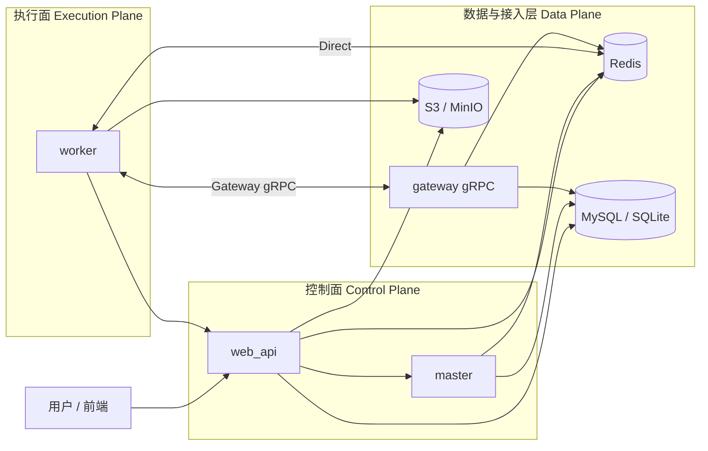

# AntCode

[](https://github.com/xyuns-cc/AntCode/actions/workflows/ci.yml)
[](https://github.com/xyuns-cc/AntCode/actions/workflows/docker-build.yml)

**为企业级生产环境打造的分布式任务调度与执行平台。**

AntCode 的核心理念是将**控制面（Control Plane）**与**执行面（Execution Plane）**彻底解耦。这种设计让系统在面对大规模节点扩展时，依然能保持卓越的可观测性、稳定性和治理能力。

无论是即便捷的内网直连，还是安全的公网网关接入，AntCode 都能从容应对。

---

## 🌟 为什么选择 AntCode？

在构建分布式系统时，我们常常面临不仅要“跑得通”，更要“管得住”的挑战。AntCode 正是为此而生：

- **控制与执行分离**：清晰的职责边界，让你可以独立扩容控制节点或执行节点，故障互不蔓延。
- **双通道无缝接入**：同一套执行引擎，既能通过内网 Redis 直连享受极低延迟，也能通过 gRPC 网关安全穿越公网，打破网络隔离。
- **全链路可观测**：从任务下发到执行结束，每一行日志、每一次状态变更都清晰可查，不再是黑盒运行。
- **工程化最佳实践**：从本地快速开发，到 Docker 一键联调，再到生产环境部署，我们提供了一致且流畅的工程体验。

## 🚀 核心能力

AntCode 不仅仅是一个任务调度器，它是一套完整的任务执行解决方案：

- **灵活的调度编排**：支持一次性任务、周期性任务以及 Cron 表达式调度，满足各种业务触发场景。
- **分布式与弹性扩展**：Worker 节点可跨服务器、跨网络部署，随业务负载动态伸缩。
- **实时反馈机制**：支持实时日志流传输与执行结果回传，让你随时掌握任务脉搏。
- **自动化运行时管理**：内置 Python 运行时自动准备与环境隔离，无需手动配置复杂的依赖环境。
- **高效文件分发**：利用 S3 预签名 URL 分发项目文件，大幅降低中心节点的带宽压力，提升分发效率。

## 🏗️ 系统架构

AntCode 采用分层架构设计，确保每一层都专注于自己的核心职责。



## ⚡ 快速上手

想要立即体验 AntCode？按照以下步骤，几分钟内即可启动一套完整的开发环境。

### 1. 环境准备

请确保你的本地环境已安装以下工具：
- **Python 3.11+**
- **Node.js 22+**
- **uv** (一款极速 Python 包管理器)

初始化项目环境：

```bash
cp .env.example .env
uv sync
```

### 2. 启动服务

**终端 1：启动控制面服务**

```bash
# 启动 Web API
uv run python -m antcode_web_api &
# 启动 调度器
uv run python -m antcode_master &
# 启动 网关服务
uv run python -m antcode_gateway
```

**终端 2：启动 Worker 节点**

```bash
# 启动一个名为 Worker-001 的执行节点
uv run python -m antcode_worker --name Worker-001 --port 8001
```

**终端 3：启动前端界面**

```bash
cd web/antcode-frontend
npm install
npm run dev
```

### Docker 一键联调

如果你更喜欢容器化体验，可以直接使用 Docker Compose 启动全栈环境：

```bash
cd infra/docker
cp .env.example .env
docker compose -f docker-compose.dev.yml up -d
```

启动后，你可以通过以下地址访问各项服务：
- **Web API**: `http://localhost:8000`
- **Swagger 文档**: `http://localhost:8000/docs`
- **AntCode 控制台**: `http://localhost:3000`
- **Gateway gRPC**: `localhost:50051`

## 📚 文档指引

我们为你准备了详细的文档，帮助你深入了解 AntCode 的方方面面：

- **[文档总览](docs/README.md)**：文档导航地图。
- **[架构深度解析](docs/ARCHITECTURE.md)**：理解服务分层与数据流向。
- **[系统配置指南](docs/system-config.md)**：环境变量与配置项详解。
- **[Worker 通信原理](docs/worker-transport.md)**：深入了解 Direct 与 Gateway 模式。
- **[数据库与迁移](docs/database-setup.md)**：数据库选型与 Schema 管理。
- **[Docker 部署手册](infra/docker/README.md)**：容器化部署最佳实践。

## 🤝 贡献与反馈

AntCode 是一个开源项目，我们需要你的声音！

- **提交反馈**：遇到问题或有改进建议？欢迎提交 Issue 或 PR。
- **安全准则**：在提交代码时，请务必不要包含真实的密钥、账号或数据库连接串。
- **代码规范**：PR 请包含变更背景、验证步骤及回滚方案，帮助我们更快地完成评审。

让我们一起打造更优秀的任务调度平台！

