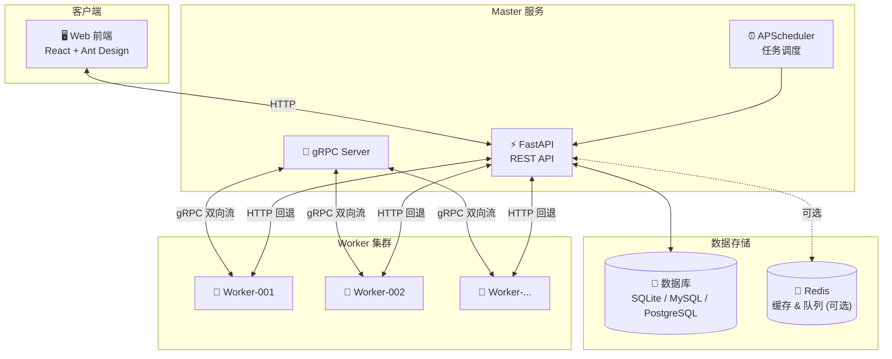

# AntCode

一个现代化的分布式任务调度和项目管理平台，支持 Python 项目的自动化执行、环境管理和实时监控。

## ✨ 主要功能

- 🚀 **项目管理** - 支持 Python 脚本和代码文件的上传、管理和执行
- 📅 **任务调度** - 灵活的定时任务配置（一次性、周期性、Cron 表达式）
- 🐍 **环境管理** - 自动创建和管理虚拟环境，支持 venv 和 mise
- 📊 **实时监控** - WebSocket 实时推送任务执行状态和日志
- 📝 **日志管理** - 完整的任务执行日志记录和查询
- 💾 **多数据库支持** - SQLite/MySQL/PostgreSQL 可选
- ⚡ **缓存优化** - 支持 Redis 或内存缓存
- 🔄 **分布式架构** - Master-Worker 架构，支持多节点扩展

## 🏗️ 系统架构



**核心特性：**
- **gRPC 优先通信** - 低延迟双向流，支持实时日志推送
- **HTTP 自动回退** - 网络异常时自动降级，保证可用性
- **弹性容错** - 熔断器 + 服务降级 + 健康检查

## 🛠️ 技术栈

| 模块 | 技术 | 说明 |
|------|------|------|
| **后端** | FastAPI + Tortoise ORM | 高性能异步 Web 框架 |
| **前端** | React 18 + TypeScript + Ant Design | 现代化 UI |
| **Worker** | Python + gRPC/HTTP | 分布式任务执行节点 |
| **通信** | gRPC + WebSocket | 高性能双向通信 |
| **调度** | APScheduler | 灵活的任务调度 |
| **缓存** | Redis / 内存 | 可选缓存后端 |

## 📁 项目结构

```
AntCode/
├── src/                        # 后端源代码
│   ├── api/v1/                 # REST API 路由
│   ├── core/                   # 核心模块（配置、认证、日志）
│   ├── models/                 # 数据库模型（Tortoise ORM）
│   ├── schemas/                # Pydantic 请求/响应模式
│   ├── services/               # 业务逻辑服务
│   │   ├── grpc/               # gRPC 服务端实现
│   │   ├── scheduler/          # 任务调度服务
│   │   ├── nodes/              # 节点管理服务
│   │   └── ...                 # 其他业务服务
│   ├── grpc_generated/         # gRPC 生成代码
│   └── tasks/antcode_worker/   # Worker 节点（独立部署）
│
├── web/antcode-frontend/       # 前端源代码
│   ├── src/
│   │   ├── components/         # 可复用组件
│   │   ├── pages/              # 页面组件
│   │   ├── services/           # API 调用服务
│   │   ├── stores/             # Zustand 状态管理
│   │   └── types/              # TypeScript 类型定义
│   └── ...
│
├── proto/                      # Protocol Buffers 定义
├── docker/                     # Docker 部署配置
├── docs/                       # 项目文档
├── scripts/                    # 工具脚本
└── data/                       # 运行时数据（不提交）
```

## 📦 快速开始

### 环境要求

- Python 3.11+
- Node.js 22+
- uv（Python 包管理器）

### 安装步骤

```bash
# 1. 克隆项目
git clone https://github.com/xyuns-cc/AntCode.git
cd AntCode

# 2. 配置环境变量
cp .env.example .env

# 3. 安装后端依赖
uv sync

# 4. 安装前端依赖
cd web/antcode-frontend && npm install && cd ../..

# 5. 启动后端服务
uv run python -m src.main

# 6. 启动前端开发服务（新终端）
cd web/antcode-frontend && npm run dev
```

### 访问应用

| 服务 | 地址 | 说明 |
|------|------|------|
| 前端 | http://localhost:3000 | Web 管理界面 |
| 后端 API | http://localhost:8000 | REST API |
| gRPC | localhost:50051 | Worker 通信端口 |

默认管理员账号：`admin` / `Admin123!`

## 🐳 Docker 部署

```bash
cd docker
docker compose up -d
```

详细配置请参考 [docker/README.md](docker/README.md)

## 📖 环境变量配置

| 变量 | 说明 | 默认值 |
|------|------|--------|
| `DATABASE_URL` | 数据库连接（留空用 SQLite） | 空 |
| `REDIS_URL` | Redis 连接（留空用内存缓存） | 空 |
| `SERVER_PORT` | 后端端口 | 8000 |
| `FRONTEND_PORT` | 前端端口 | 3000 |
| `GRPC_ENABLED` | 是否启用 gRPC | true |
| `GRPC_PORT` | gRPC 服务端口 | 50051 |
| `LOG_LEVEL` | 日志级别 | INFO |

详细配置请参考 [docker/ENV_CONFIG.md](docker/ENV_CONFIG.md)

### 可扩展性配置

系统支持从单机到 300+ 节点的渐进式扩展：

| 变量 | 说明 | 默认值 |
|------|------|--------|
| `QUEUE_BACKEND` | 任务队列后端（`memory` 或 `redis`） | `memory` |
| `LOG_BUFFER_SIZE` | Worker 日志批量发送阈值 | 50 |
| `PROJECT_CACHE_MAX_SIZE` | Worker 项目缓存数量上限 | 100 |

**最简模式（默认）：** 零外部依赖，适合开发测试

```bash
QUEUE_BACKEND=memory
```

**生产模式：** 使用 Redis 队列，支持多 Master 实例

```bash
QUEUE_BACKEND=redis
REDIS_URL=redis://localhost:6379/0
```

## 📚 模块文档

| 模块 | 文档 | 说明 |
|------|------|------|
| 后端 | [src/README.md](src/README.md) | API 服务、业务逻辑、数据模型 |
| 前端 | [web/antcode-frontend/README.md](web/antcode-frontend/README.md) | React 应用、组件、状态管理 |
| Worker | [src/tasks/antcode_worker/README.md](src/tasks/antcode_worker/README.md) | 分布式执行节点、调度引擎 |
| Docker | [docker/README.md](docker/README.md) | 容器化部署配置 |

## 📖 详细文档

| 文档 | 说明 |
|------|------|
| [文档中心](docs/README.md) | 文档索引与导航 |
| [数据库配置](docs/database-setup.md) | 数据库配置与迁移 |
| [gRPC 通信](docs/grpc-communication.md) | Master-Worker 通信协议 |
| [节点管理](docs/node-env-management.md) | 节点能力与环境管理 |
| [系统配置](docs/system-config.md) | 运行时参数配置 |
| [弹性容错](docs/resilience.md) | 熔断器、降级、健康检查 |

## 🔧 开发指南

### 代码规范

**Python（后端/Worker）：**
- 遵循 PEP 8，4 空格缩进
- 补全类型提示，使用 async/await
- 函数/字段用 snake_case，类用 PascalCase
- 使用 loguru 记录结构化日志

**TypeScript（前端）：**
- 组件 PascalCase，hooks 以 `use*` 开头
- API 调用仅放 `services/*.ts`
- 避免 `any`，复用 `types/` 定义
- 使用 Ant Design 主题变量

### 常用命令

```bash
# 后端
uv run python -m src.main                    # 启动后端
uv run uvicorn src.asgi:app --reload --port 8000  # 开发模式

# 前端
cd web/antcode-frontend
npm run dev          # 开发服务器
npm run build        # 生产构建
npm run lint         # 代码检查
npm run type-check   # 类型检查

# Worker
cd src/tasks/antcode_worker
uv sync
python -m antcode_worker --name Worker-001 --port 8001

# gRPC 代码生成
uv run python scripts/generate_proto.py
```

## 📄 许可证

[MIT License](LICENSE)
